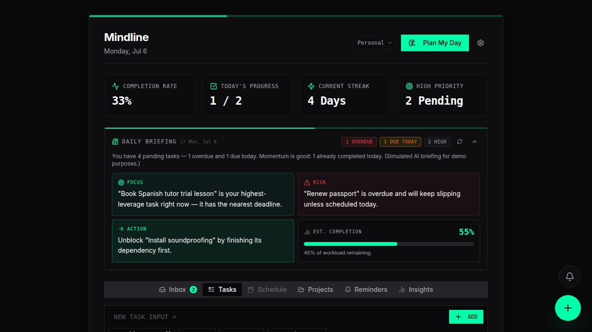

# Mindline — Showcase

An AI-powered productivity and task management app with intelligent daily briefings, priority-aware day planning, and a fully themeable multi-layout UI.

> **This is the frontend showcase build.** It runs 100% in the browser against an in-memory demo data layer — no backend, no database, no API keys. The full version of Mindline pairs this frontend with an Express + PostgreSQL backend and real AI-powered features behind a contract-first OpenAPI spec. AI features in this demo (daily briefing, day planning, priority scoring) are simulated and clearly labeled as such.



## Features

- **Daily Briefing** — an intelligence report for your day: today's focus, biggest risk, recommended action, and estimated completion, with live stat badges (overdue / due today / high priority)
- **Plan My Day** — one click generates an optimized schedule from pending tasks, respecting priorities, deadlines, estimated durations, and task dependencies
- **Inbox (frictionless capture)** — capture thoughts instantly via a floating "+" or the `C` shortcut, then process items into tasks or projects when you're ready
- **Tasks & Projects** — full CRUD with inline editing, priorities, deadlines, time estimates, tags, per-project colors/status, and task dependencies with blocked-task detection
- **Reminders & Alarms** — one-time and recurring (daily / weekdays / weekly / monthly) reminders attached to tasks, projects, or standalone events, with snooze/dismiss/complete, per-reminder event history, and a floating notification bell
- **Productivity Insights** — completion rate, streaks, and an hourly completion heatmap
- **Multiple Workspaces** — switch between contexts (e.g. Personal / Work) with isolated tasks and projects
- **3 Themes × 3 Layouts** — Terminal (dark green), Minimal (dark grey), and Soft (light pastel) themes, each combinable with Terminal, Focus, or Soft layouts. Themes and layouts are fully independent — any combination works

## Tech Stack

- **React 19** + **TypeScript** (strict mode)
- **Vite 7** with the Tailwind CSS v4 plugin
- **TanStack React Query 5** for all data fetching/mutation state
- **Tailwind CSS 4** with CSS-variable-driven theming (`data-theme` on `<html>`)
- **Radix UI** primitives + shadcn-style component library
- **Framer Motion** for micro-interactions
- **wouter** for routing

### Architecture notes

- The real app is **contract-first**: an OpenAPI spec is the source of truth, with generated React Query hooks and Zod schemas. This showcase preserves that exact hook surface in [`src/mock-api/`](src/mock-api/) — the rest of the frontend is identical to production code
- Themes control all color/font/radius via CSS variables; layouts control only structure and information density. The two axes never couple
- The mock data layer simulates ~200ms network latency so loading states behave realistically

## Getting Started

```bash
npm install   # or pnpm install / yarn
npm run dev
```

Open http://localhost:5173 — that's it. No environment variables, no database, no services.

| Script | What it does |
| --- | --- |
| `npm run dev` | Start the dev server on port 5173 |
| `npm run build` | Production build to `dist/public` |
| `npm run serve` | Preview the production build |
| `npm run typecheck` | Strict TypeScript check |

## Project Structure

```
src/
├── components/       # Feature components + ui/ primitives
├── hooks/            # Shared hooks (dashboard data, notifications, …)
├── layouts/          # Terminal, Focus, and Soft layout shells
├── lib/              # Theme, layout, workspace contexts + utilities
├── mock-api/         # In-memory demo data layer (replaces the real API client)
│   ├── types.ts      #   API type definitions (mirrors the OpenAPI contract)
│   ├── store.ts      #   Seeded store: workspaces, projects, tasks, reminders
│   └── hooks.ts      #   React Query hooks with the production call signatures
└── pages/            # Route-level pages
```

## Demo Data

The store seeds two workspaces (Personal and Work) with projects, interdependent tasks, inbox items, and reminders — all timestamped relative to "now" so the demo always feels live. Everything is fully interactive: create, edit, complete, snooze, process, plan. Data resets on page reload.

## Roadmap (full version)

- Real AI briefings, task scoring, and day planning via LLM integration
- Persistent backend (Express + PostgreSQL + Drizzle ORM)
- AI-driven reminder management (create / postpone / cancel by an assistant)
- Natural-language task capture
- Calendar integration for Plan My Day

## License

[MIT](LICENSE)
